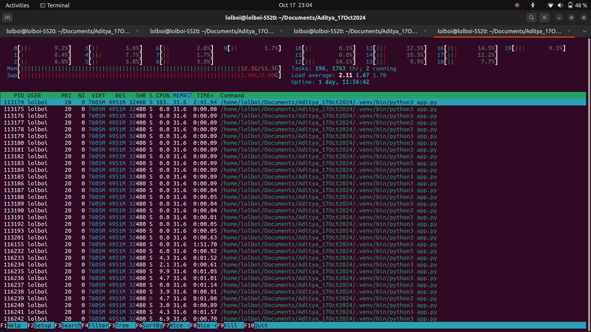

# Uptime Monitoring Backend

The video demo is [available here](https://drive.google.com/file/d/1-fQX2HrPREDdOZ7QqdegGsQIrIHFB_J1/view?usp=sharing)

This project is a backend API built using Flask and SQLAlchemy to monitor the uptime and downtime of various restaurants based on their business hours and polling data. The backend generates reports for restaurant owners to analyze how often their stores went inactive during business hours. The API is designed to handle dynamic data, which is periodically updated.

## Problem Statement

Restaurants are polled periodically (approximately once an hour), and their status (active/inactive) is recorded. The API needs to generate a report on the uptime and downtime during the restaurant's business hours, interpolating missing data where necessary. The data is provided in CSV files, including:

1. Poll data (store status, timestamp)
2. Business hours (store ID, day of the week, opening/closing times)
3. Time zones (store ID, time zone)

The report includes the uptime and downtime over the last hour, day, and week.

## Features

### API Endpoints

1. **`/trigger_report`** (POST):
   - Triggers the report generation for all stores.
   - Returns a `report_id`, which is used to track the report generation status.
2. **`/get_report/<report_id>`** (GET):
   - Fetches the report status. If the report is complete, it returns the CSV file containing the report.
   - If the report is still being generated, it returns a "Running" status.

### Data Sources

- **Poll Data**: Contains the store ID, UTC timestamp, and the store status (active/inactive).
- **Business Hours**: Contains the store ID, day of the week, opening and closing times in the store's local time.
- **Time Zones**: Contains the store ID and its respective time zone.

### Report Schema

The report includes:

- **Store ID**
- **Uptime and downtime** for the last hour (in minutes), last day (in hours), and last week (in hours), calculated only within business hours. The backend extrapolates missing data based on the polling frequency.

## Code Structure

### app.py

This file contains the entire logic for the backend. The following sections explain key parts of the code:

1. **Flask Setup and Models**:
   - Flask is initialized with a MySQL connection using SQLAlchemy.
   - Four models are defined: `PollData`, `BusinessHours`, `Timezones`, and `Report` to handle the polling data, business hours, time zones, and report generation, respectively.

2. **Data Loading**:
   - `load_csv_data`: This function loads the CSV data into the database tables (`PollData`, `BusinessHours`, `Timezones`). This is executed once during initialization.

3. **Uptime/Downtime Calculation**:
   - `calculate_uptime_downtime`: This function computes the uptime and downtime of a store within its business hours based on the polling data. If polling data is missing for a given time window, the function interpolates the data based on the surrounding polls.

4. **Parallel Processing**:
   - The store reports are processed in parallel using Python’s `ThreadPoolExecutor`, which speeds up the generation of reports for multiple stores.

5. **Report Generation**:
   - `generate_report`: This function collects data for all stores, processes the uptime/downtime calculation, and writes the results into a CSV file. The report generation is triggered by the `/trigger_report` endpoint.

## Key Design Choices

1. **Dynamic Data Handling**:
   - The API is designed to handle dynamic data that is updated periodically. The `/trigger_report` endpoint always generates the report based on the latest data in the database.

2. **Extrapolation Logic**:
   - If polling data is missing for certain intervals within business hours, the system interpolates uptime and downtime based on surrounding polls. This ensures accurate reports even when the polling frequency is sparse.

3. **Threaded Report Generation**:
   - The report generation is executed in parallel across multiple stores using `ThreadPoolExecutor`. This allows for faster processing of large datasets.

4. **Database Structure**:
   - The data is stored in normalized tables (`PollData`, `BusinessHours`, `Timezones`, `Reports`) to ensure efficient querying and reporting.

5. **Error Handling**:
   - Basic error handling is implemented for scenarios like missing report IDs or incomplete reports. The report generation process updates the status in the database.

## Installation

### Prerequisites

Please refer to `requirements.txt`.

### Setup

1. Clone the repository.
2. Install the required packages:

   ```bash
   pip install -r requirements.txt
   ```

3. Set up the MySQL database and update the connection string in `app.py`.
4. Initialize the database (Uncomment the relavent sections of Python code, check the comments preceding the code).
5. Load the CSV data (Uncomment the relavent sections of Python code, check the comments preceding the code).

## Running the Application

1. Start the application:

    ```bash
    python3 app.py
    ```

2. To trigger the report creation, run the following command after starting the application:

    ```bash
    curl -X POST http://127.0.0.1:5000/trigger_report
    ```

3. Once this completes, you will receive the `report-id` in your terminal. Use this to run the command

    ```bash
    curl http://127.0.0.1:5000/get_report/<report_id>
    ```

    This returns the status of the report or the CSV file if the report is complete.

*P.S.: The database and MySQL credentials have been hardcoded for the purposes of this assignment. Please change it as per your requirements.*

## Improving the code

The following optimizations can be achieved with additional changes:

1. **Eliminating the hardcoded aspects of the assignment**: This can be done by using the `os` module in python to load the variables.

2. **Improving the performance of the database queries**: This can be done by indexing the tables in our database. Indexing helps our queries to avoid scanning entire tables to process every query. This will be most effective in `store_status.csv` file as it has the most entries of the three tables given.

3. **Improving the thread management**: Currently, we are using the `ThreadPoolExecutor` module to enable parallel processing and faster report generation. However, we do not optimize the number of running threads. With out current implementation, we may be running more than necessary threads, which may consume extra resources. One way of doing this is:

    ```bash
    import os
    from concurrent.futures import ThreadPoolExecutor

    # Use the number of CPU cores as the default max_workers
    MAX_WORKERS = int(os.getenv("MAX_WORKERS", os.cpu_count()))

    with ThreadPoolExecutor(max_workers=min(len(stores), MAX_WORKERS)) as executor:
    executor.map(lambda store: process_store(store[0]), stores)
    ```

4. **Improving the data loading process**: Currently, we are loading all the data into our memory. The attached image shows a snapshot of the `htop` command while the app is running in the background.

    

    As evident by the screenshot, our app has a large memory footprint. The memory usage is over 12.5GB, and the swap memory is almost fully used. Thus, memory becomes a massive bottleneck.

    This problem can be mitigated by ***lazy loading***, a process wherein we load only the necessary data each time, instead of loading it all at once. This is done by fetching the data in batches. A typical example would be something like this command:

    ```bash
    poll_data = PollData.query.filter_by(store_id=store_id).yield_per(1000)
    ```

While there may be some more issues that a production grade software must tackle, these are some areas of improvement I could identify.

## Final words

I thank **Loop** for giving me this opportunity. Special thanks to Mr. Pranayan Metiya for accomodating my needs for mid-semester exam preparation time.

Before starting this assignment, I would not have imagined myself learning Python based API building web frameworks (like `Flask` and `FastAPI`) and implementing a software using them all within a week. I have become comfortable using these frameworks and with the language of Python in general.

My understanding of how databases work has also improved significantly. I have learnt what database engines are, the differences between SQLite, MySQL and PostgreSQL and made (in my opinion) reasonable design choices. I have also understood that inferior performance of a database is not necessarily due to the choice of RDBMS used; in my case it was a result of poor query writing that took upwards of 1:30 hr to run my app the first time.

Overall, this was a wonderful learning experience. I hope to work on such exciting projects in the future, as an intern at **Loop**! (*fingers crossed*)

Fin :)

---
